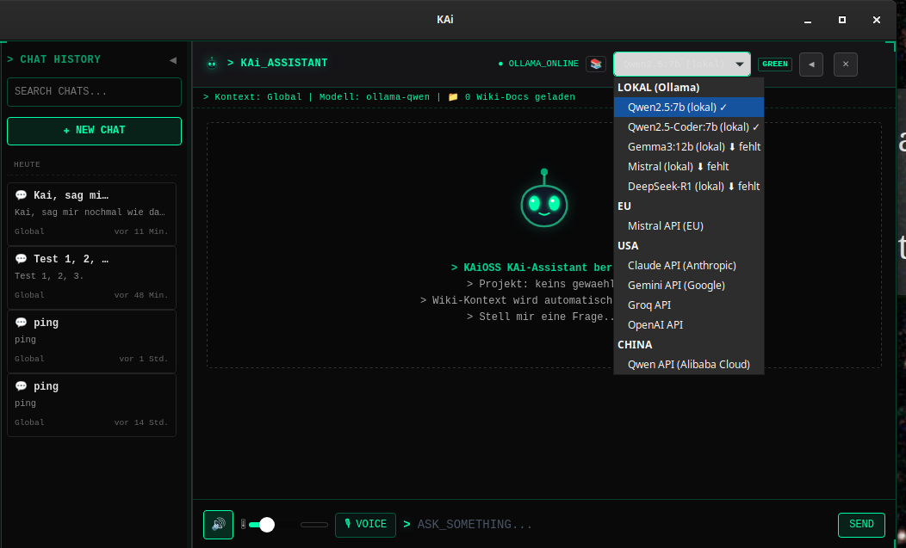

# KAiOSSChat

KAi als Desktop-App: rundes Always-on-top-Fenster mit dem kompletten
KAiOSS-Chat (Memory, Voice, Modell-Dropdown) — Tauri-2-Shell (Rust) um die
Svelte-5-Frontend-Route `/desktop-bubble` des laufenden KAiOSS-Stacks.
100 % lokal. Details: [ARCHITEKTUR.md](ARCHITEKTUR.md).

| App-Fenster (standalone, Modell-Dropdown) | Desktop-Icon |
|:---:|:---:|
|  |  |

**Status: Phase 0 (Companion-Shell) läuft.** Die App lädt
`http://localhost:5174/desktop-bubble` und braucht daher den KAiOSS-Stack
(wird von den Start-Skripten automatisch mitgestartet). Phase 1 =
Standalone-Build ohne Webserver (siehe ARCHITEKTUR.md §2.2).

## Setup & Start

```bash
./setup-imperativ.sh    # einmalig: rustup + apt-Pakete (Plan D, kein Nix)
./run.sh                # Dev-Modus (cargo tauri dev)
./install-desktop.sh    # Release bauen + "KAi" ins Menü & auf den Desktop
```

Nach `install-desktop.sh` startet das KAi-Icon die App ohne Terminal;
`start-app.sh` (vom Icon aufgerufen) prüft/startet den Stack.

## Features der Shell (src-tauri/src/main.rs)

- Fenster-Platzierung unten rechts (über Dock + Uhr)
- Mikrofon-Freigabe für kai-voice: WebKitGTK-`permission-request`-Handler
  (ohne ihn scheitert `getUserMedia` still — Default ist DENY)
- Tray-Icon mit Blinzel-Animation (2 Frames, alle ~4 s); Menü:
  anzeigen/verstecken, Beenden (AppIndicator liefert keine Klick-Events)
- Icons: `src-tauri/icons/` — Quelle `icon.svg` (KAi-Avatar aus
  AlienAvatar.svelte), gerendert mit cairosvg

## Bekannte Stolpersteine

- **Nix-Dev-Shell (flake.nix) ist DEPRECATED** — Nix-rustc + System-GTK =
  ABI-Konflikt („stack smashing"). Hauptweg ist Plan D (rustup + apt).
- **`WEBKIT_DISABLE_COMPOSITING_MODE=1` nicht setzen:** bekannter
  WebKitGTK-Bug, Webview zeichnet beim Fenster-Resize nicht neu.
  Stattdessen `LIBGL_ALWAYS_SOFTWARE=1` + `WEBKIT_DISABLE_DMABUF_RENDERER=1`
  (llvmpipe, Compositing bleibt an) — siehe run.sh.
- **Kein `window.confirm()`/`alert()` im Frontend-Code:** in der
  Tauri-Webview nicht implementiert, gibt still `false` zurück.
  Inline-Bestätigungen im UI verwenden (siehe deleteChat in KAiPanel).
